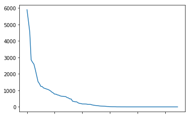
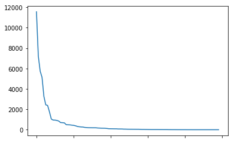
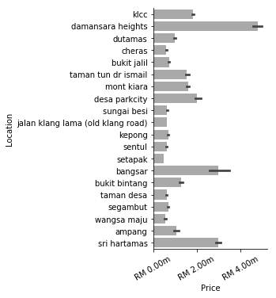
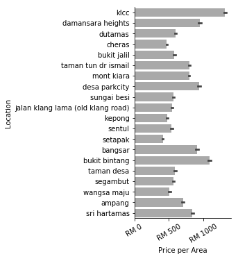
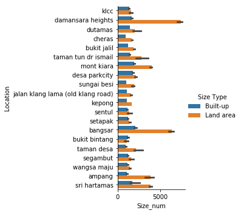
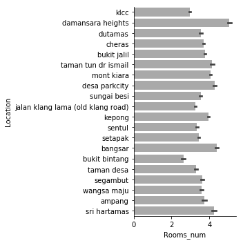

# Introduction

This is a webscraping project of property listings in Kuala Lumpur, Malaysia.

Data is made available in two forms:
- `Properties_raw.csv` is the raw data as scraped from the websites
- `Properties_processed.csv` is a (partially) processed version of the data. This file may still contain any of the following:
    - Duplicate entries
    - Badly formatted locations
    - Badly formatted property types

I do not endorse the automated scraping of any real estate or other website as it is most likely against their terms of service. For all legal intents and purposes, HTML data was downloaded in an unautomated fashion by a team of highly motivated squirrels.

# Mini-Project: Property Scraping

```python
# There is a versioning issue between seaborn and numpy that results in 
# a FutureWarning. This does not affect the results but creates an 
# annoying warning message we don't want to see every time.
# We can't do anything about it, the developers of seaborn need to update
# their code to the newest NumPy standards.
import warnings
warnings.simplefilter(action='ignore', category=FutureWarning)
```

We will be scraping property listings in Kuala Lumpur from `[REDACTED]`. Our goal is to analyze the property market in the city.

To ensure no issues with the data retrieval itself, files have been downloaded beforehand. Each HTML file corresponds to a page of property listings. Our (altered) scraping process will therefore be to analyze the HTML of the original website to find out how to extract the information we want and then apply that extraction to the HTML files stored on disk; these are direct copies of each listing page.

## Stage One: Extracting Information
The first step is to extract information from each HTML page. To speed up the class, my team of highly motivated squirrels downladed all of the property listing pages beforehand. Due to Javascript and CSS issues with offline pages, however, you should look at the (real) listing page (`[REDACTED]`) and figure out how to extract the following information from each individual property listing:

1. The neighborhood in Kuala Lumpur
2. The price of the property
3. The number of rooms, bathrooms, and car parks
4. The type of property, e.g. "Condominium (Corner)"
5. The square footage
6. The furnishing state
7. The URL to the property listing details

Once you've figured out how to extract this data from a single entry, write a script that loops over all entries and pages and saves the data in a pandas data frame. Be sure to use the locally saved pages for this so that we can avoid long waiting times!

The data frame should have a structure like so:

| Neighborhood | Price | No. Rooms | No. Bathrooms | No. Car Parks | Property Type | Square Footage | Furnishing State | URL |
| --- | --- | --- | --- | --- | --- | --- | --- | --- |
| KLCC | 1450000 | 2 | 2 | 1 | Condominium | 867 | Fully Furnished | http://www.link.com |

Not all entries will have this missing information. Be sure that your code takes this into account.

Save the dataframe to disk.


```python
%matplotlib inline
import requests
import numpy as np
from bs4 import BeautifulSoup
import pandas as pd
import os
import re
import seaborn as sns
import matplotlib.pyplot as plt
```


```python
url = "[REDACTED]"
response = requests.get(url)

soup = BeautifulSoup(response.text, "html.parser")
```


```python
# Attempt to extract info from one example
listing = soup.find("li", attrs={"class": "bWJbOM"})

def scrape_listing(listing):
    try:
        price = listing.find("li", attrs={"class": "listing-primary-price-item"}).get_text()
    except AttributeError:
        price = None
    
    try:
        # Locations don't always have a tag class!
        # Non-regex version
        for link in listing.find_all("a"):
            if "Kuala Lumpur" in link.get_text():
                location = link.get_text()
                break        
    except AttributeError:
        location = None
    
    try:
        prop_type = listing.find("p", attrs={"class": "property-type-content"})
        if prop_type is None:
            prop_type = listing.find("div", attrs={"class": "eqkyrG"}).get_text()
        else:
            prop_type = prop_type.get_text()
    except AttributeError:
        prop_type = None
    
    try:
        prop_size = listing.find("li", attrs={"class": ["builtUp-attr", "landArea-attr"]}).find("a").get_text()
    except AttributeError:
        prop_size = None
    
    try:
        prop_furnished = listing.find("li", attrs={"class": "furnishing-attr"}).find("a").get_text()
    except AttributeError:
        prop_furnished = None

    try:
        rooms = listing.find("li", attrs={"class": "bedroom-facility"}).get_text()
    except AttributeError:
        rooms = None
        
    try:
        bathrooms = listing.find("li", attrs={"class": "bathroom-facility"}).get_text()
    except AttributeError:
        bathrooms = None
        
    try:
        carParks = listing.find("li", attrs={"class": "carPark-facility"}).get_text()
    except AttributeError:
        carParks = None

    try:
        url = listing.find("a")["href"]
    except AttributeError:
        url = None

    entry = pd.Series(data={
        "Location": location,
        "Price": price, 
        "Rooms": rooms,
        "Bathrooms": bathrooms, 
        "Car Parks": carParks,
        "Property Type": prop_type,
        "Size": prop_size, 
        "Furnishing": prop_furnished,
        "URL": url})
    return entry

scrape_listing(listing)
```


    Location                             KLCC, Kuala Lumpur
    Price                                      RM 1,238,000
    Rooms                                                 2
    Bathrooms                                             2
    Car Parks                                             1
    Property Type                               Condominium
    Size                             Built-up : 736 sq. ft.
    Furnishing                             Partly Furnished
    URL              /property/klcc/10-stonor/sale-6597351/
    dtype: object


```python
# Loop through all examples of a page
def scrape_page(page_id):
    with open("[REDACTED]/page_{}.html".format(page_id), "r") as f:
        html = f.read()
    
    soup = BeautifulSoup(html, "html.parser")
    
    listings = soup.find_all("li", attrs={"class": "bWJbOM"})
    page_listings = []
    for listing in listings:
        page_listings.append(scrape_listing(listing))
    return pd.DataFrame(page_listings)

scrape_page(1)
```


<div>
<style scoped>
    .dataframe tbody tr th:only-of-type {
        vertical-align: middle;
    }

    .dataframe tbody tr th {
        vertical-align: top;
    }

    .dataframe thead th {
        text-align: right;
    }
</style>
<table border="1" class="dataframe">
  <thead>
    <tr style="text-align: right;">
      <th></th>
      <th>Location</th>
      <th>Price</th>
      <th>Rooms</th>
      <th>Bathrooms</th>
      <th>Car Parks</th>
      <th>Property Type</th>
      <th>Size</th>
      <th>Furnishing</th>
      <th>URL</th>
    </tr>
  </thead>
  <tbody>
    <tr>
      <th>0</th>
      <td>KLCC, Kuala Lumpur</td>
      <td>RM 1,250,000</td>
      <td>2+1</td>
      <td>3</td>
      <td>2</td>
      <td>Serviced Residence</td>
      <td>Built-up : 1,335 sq. ft.</td>
      <td>Fully Furnished</td>
      <td>/property/klcc/setia-sky-residences/sale-6528715/</td>
    </tr>
    <tr>
      <th>1</th>
      <td>Damansara Heights, Kuala Lumpur</td>
      <td>RM 6,800,000</td>
      <td>6</td>
      <td>7</td>
      <td>None</td>
      <td>Bungalow</td>
      <td>Land area : 6900 sq. ft.</td>
      <td>Partly Furnished</td>
      <td>/property/damansara-heights/sale-6692423/</td>
    </tr>
    <tr>
      <th>2</th>
      <td>Dutamas, Kuala Lumpur</td>
      <td>RM 1,030,000</td>
      <td>3</td>
      <td>4</td>
      <td>2</td>
      <td>Condominium (Corner)</td>
      <td>Built-up : 1,875 sq. ft.</td>
      <td>Partly Furnished</td>
      <td>/property/dutamas/concerto-north-kiara/sale-68...</td>
    </tr>
    <tr>
      <th>3</th>
      <td>Cheras, Kuala Lumpur</td>
      <td>None</td>
      <td>None</td>
      <td>None</td>
      <td>None</td>
      <td>None</td>
      <td>None</td>
      <td>None</td>
      <td>/new-property/property/cheras/j-dupion/new-5811/</td>
    </tr>
    <tr>
      <th>4</th>
      <td>Bukit Jalil, Kuala Lumpur</td>
      <td>RM 900,000</td>
      <td>4+1</td>
      <td>3</td>
      <td>2</td>
      <td>Condominium (Corner)</td>
      <td>Built-up : 1,513 sq. ft.</td>
      <td>Partly Furnished</td>
      <td>/property/bukit-jalil/the-rainz/sale-6636230/</td>
    </tr>
    <tr>
      <th>5</th>
      <td>Ttdi, Burhanuddin Helmi, Kl, Kuala Lumpur, Tam...</td>
      <td>RM 5,350,000</td>
      <td>4+2</td>
      <td>5</td>
      <td>4</td>
      <td>Bungalow</td>
      <td>Land area : 7200 sq. ft.</td>
      <td>Partly Furnished</td>
      <td>/property/taman-tun-dr-ismail/sale-6474574/</td>
    </tr>
    <tr>
      <th>6</th>
      <td>Seputeh, Kuala Lumpur</td>
      <td>None</td>
      <td>None</td>
      <td>None</td>
      <td>None</td>
      <td>None</td>
      <td>None</td>
      <td>None</td>
      <td>/new-property/property/seputeh/setia-sky-seput...</td>
    </tr>
    <tr>
      <th>7</th>
      <td>Taman Tun Dr Ismail, Kuala Lumpur</td>
      <td>RM 2,600,000</td>
      <td>5</td>
      <td>4</td>
      <td>4</td>
      <td>Semi-detached House</td>
      <td>Land area : 3600 sq. ft.</td>
      <td>Partly Furnished</td>
      <td>/property/taman-tun-dr-ismail/sale-6455023/</td>
    </tr>
    <tr>
      <th>8</th>
      <td>Taman Tun Dr Ismail, Kuala Lumpur</td>
      <td>RM 1,950,000</td>
      <td>4+1</td>
      <td>4</td>
      <td>3</td>
      <td>2-sty Terrace/Link House (EndLot)</td>
      <td>Land area : 25x75 sq. ft.</td>
      <td>Partly Furnished</td>
      <td>/property/taman-tun-dr-ismail/sale-5375170/</td>
    </tr>
    <tr>
      <th>9</th>
      <td>Sri Petaling, Kuala Lumpur</td>
      <td>RM 385,000</td>
      <td>3</td>
      <td>2</td>
      <td>1</td>
      <td>Apartment (Intermediate)</td>
      <td>Built-up : 904 sq. ft.</td>
      <td>Partly Furnished</td>
      <td>/property/sri-petaling/1-petaling/sale-5788891/</td>
    </tr>
    <tr>
      <th>10</th>
      <td>Ampang Hilir, Kuala Lumpur</td>
      <td>None</td>
      <td>None</td>
      <td>None</td>
      <td>None</td>
      <td>None</td>
      <td>None</td>
      <td>None</td>
      <td>/new-property/property/ampang-hilir/datum-jela...</td>
    </tr>
    <tr>
      <th>11</th>
      <td>Taman Tun Dr Ismail, Kuala Lumpur</td>
      <td>RM 1,680,000</td>
      <td>4</td>
      <td>3</td>
      <td>None</td>
      <td>2-sty Terrace/Link House (Intermediate)</td>
      <td>Land area : 22 x 80 sq. ft.</td>
      <td>Partly Furnished</td>
      <td>/property/taman-tun-dr-ismail/sale-6775068/</td>
    </tr>
    <tr>
      <th>12</th>
      <td>Taman Tun Dr Ismail, Kuala Lumpur</td>
      <td>RM 1,700,000</td>
      <td>3+1</td>
      <td>3</td>
      <td>None</td>
      <td>2-sty Terrace/Link House (Intermediate)</td>
      <td>Land area : 1900 sq. ft.</td>
      <td>Partly Furnished</td>
      <td>/property/taman-tun-dr-ismail/sale-6682007/</td>
    </tr>
    <tr>
      <th>13</th>
      <td>Taman Tun Dr Ismail, Kuala Lumpur</td>
      <td>RM 4,580,000</td>
      <td>6+1</td>
      <td>5</td>
      <td>5</td>
      <td>Bungalow (Intermediate)</td>
      <td>Land area : 6000 sq. ft.</td>
      <td>Partly Furnished</td>
      <td>/property/taman-tun-dr-ismail/sale-4818565/</td>
    </tr>
    <tr>
      <th>14</th>
      <td>Bukit Jalil, Kuala Lumpur</td>
      <td>None</td>
      <td>None</td>
      <td>None</td>
      <td>None</td>
      <td>None</td>
      <td>None</td>
      <td>None</td>
      <td>/new-property/property/bukit-jalil/lbs-residen...</td>
    </tr>
    <tr>
      <th>15</th>
      <td>Taman Tun Dr Ismail, Kuala Lumpur</td>
      <td>RM 3,100,000</td>
      <td>4+1</td>
      <td>3</td>
      <td>None</td>
      <td>Semi-detached House (Intermediate)</td>
      <td>Land area : 3600 sq. ft.</td>
      <td>Partly Furnished</td>
      <td>/property/taman-tun-dr-ismail/sale-3453901/</td>
    </tr>
    <tr>
      <th>16</th>
      <td>Bukit Tunku (Kenny Hills), Kuala Lumpur</td>
      <td>RM 9,000,000</td>
      <td>6+1</td>
      <td>7</td>
      <td>4</td>
      <td>Bungalow (Corner)</td>
      <td>Land area : 8500 sq. ft.</td>
      <td>Partly Furnished</td>
      <td>/property/bukit-tunku-kenny-hills/sale-6777463/</td>
    </tr>
    <tr>
      <th>17</th>
      <td>Damansara Heights, Kuala Lumpur</td>
      <td>RM 4,500,000</td>
      <td>5+1</td>
      <td>7</td>
      <td>None</td>
      <td>Bungalow (Corner)</td>
      <td>Built-up : 4,842 sq. ft.</td>
      <td>Partly Furnished</td>
      <td>/property/damansara-heights/sale-4606122/</td>
    </tr>
    <tr>
      <th>18</th>
      <td>Mont Kiara, Kuala Lumpur</td>
      <td>RM 1,780,000</td>
      <td>4+1</td>
      <td>4</td>
      <td>2</td>
      <td>Condominium (Corner)</td>
      <td>Built-up : 1,830 sq. ft.</td>
      <td>Partly Furnished</td>
      <td>/property/mont-kiara/pavilion-hilltop/sale-686...</td>
    </tr>
    <tr>
      <th>19</th>
      <td>Mont Kiara, Kuala Lumpur</td>
      <td>RM 3,450,000</td>
      <td>4+1</td>
      <td>6</td>
      <td>3</td>
      <td>Condominium (Corner)</td>
      <td>Built-up : 3,720 sq. ft.</td>
      <td>Fully Furnished</td>
      <td>/property/mont-kiara/10-mont-kiara-mk-10/sale-...</td>
    </tr>
    <tr>
      <th>20</th>
      <td>Desa ParkCity, Kuala Lumpur</td>
      <td>RM 1,500,000</td>
      <td>3+2</td>
      <td>4</td>
      <td>2</td>
      <td>Condominium (Corner)</td>
      <td>Built-up : 1,798 sq. ft.</td>
      <td>Partly Furnished</td>
      <td>/property/desa-park-city/westside-three/sale-6...</td>
    </tr>
    <tr>
      <th>21</th>
      <td>Damansara Heights, Kuala Lumpur</td>
      <td>RM 1,550,000</td>
      <td>1</td>
      <td>1</td>
      <td>1</td>
      <td>Serviced Residence (Intermediate)</td>
      <td>Built-up : 904 sq. ft.</td>
      <td>Fully Furnished</td>
      <td>/property/damansara-heights/damansara-city-res...</td>
    </tr>
    <tr>
      <th>22</th>
      <td>Mont Kiara, Kuala Lumpur</td>
      <td>RM 1,500,000</td>
      <td>3+1</td>
      <td>4</td>
      <td>3</td>
      <td>Condominium</td>
      <td>Built-up : 2,163 sq. ft.</td>
      <td>Fully Furnished</td>
      <td>/property/mont-kiara/mont-kiara-aman/sale-6875...</td>
    </tr>
    <tr>
      <th>23</th>
      <td>Mont Kiara, Kuala Lumpur</td>
      <td>RM 1,450,000</td>
      <td>3+1</td>
      <td>4</td>
      <td>None</td>
      <td>Condominium</td>
      <td>Built-up : 2,163 sq. ft.</td>
      <td>Fully Furnished</td>
      <td>/property/mont-kiara/mont-kiara-aman/sale-6875...</td>
    </tr>
  </tbody>
</table>
</div>


```python
# Loop through all pages
# This takes a while, so only do this if the output file doesn't exist yet
if not os.path.exists("Properties_raw.csv"):
    all_listings = []
    for page_counter in range(1, 2704):
        print("Page {}".format(page_counter))
        all_listings.append(scrape_page(page_counter))

    properties = pd.concat(all_listings)
    properties = properties.reset_index(drop=True)
    properties.to_csv("Properties_raw.csv", index=False)
```

## Stage Two: Data Pre-Processing
Next, we want to clean the data. 

```python
properties = pd.read_csv("Properties_raw.csv")
properties.sample(5)
```


<div>
<style scoped>
    .dataframe tbody tr th:only-of-type {
        vertical-align: middle;
    }

    .dataframe tbody tr th {
        vertical-align: top;
    }

    .dataframe thead th {
        text-align: right;
    }
</style>
<table border="1" class="dataframe">
  <thead>
    <tr style="text-align: right;">
      <th></th>
      <th>Location</th>
      <th>Price</th>
      <th>Rooms</th>
      <th>Bathrooms</th>
      <th>Car Parks</th>
      <th>Property Type</th>
      <th>Size</th>
      <th>Furnishing</th>
      <th>URL</th>
    </tr>
  </thead>
  <tbody>
    <tr>
      <th>27712</th>
      <td>Jalan Klang Lama (Old Klang Road), Kuala Lumpur</td>
      <td>RM 395,000</td>
      <td>1</td>
      <td>2.0</td>
      <td>NaN</td>
      <td>Serviced Residence (EndLot)</td>
      <td>Built-up : 775 sq. ft.</td>
      <td>Fully Furnished</td>
      <td>/property/jalan-klang-lama-old-klang-road/the-...</td>
    </tr>
    <tr>
      <th>2962</th>
      <td>Kepong, Kuala Lumpur</td>
      <td>RM 580,000</td>
      <td>3</td>
      <td>2.0</td>
      <td>3.0</td>
      <td>1-sty Terrace/Link House (Intermediate)</td>
      <td>Land area : 130. sq. ft.</td>
      <td>Fully Furnished</td>
      <td>/property/kepong/sale-6723519/</td>
    </tr>
    <tr>
      <th>46469</th>
      <td>KLCC, Kuala Lumpur</td>
      <td>RM 4,344,600</td>
      <td>3+1</td>
      <td>4.0</td>
      <td>NaN</td>
      <td>Condominium</td>
      <td>Built-up : 2,228 sq. ft.</td>
      <td>Partly Furnished</td>
      <td>/property/klcc/the-binjai-on-the-park/sale-409...</td>
    </tr>
    <tr>
      <th>44617</th>
      <td>Kuchai Lama, Kuala Lumpur</td>
      <td>RM 300,000</td>
      <td>3</td>
      <td>2.0</td>
      <td>1.0</td>
      <td>Apartment (Intermediate)</td>
      <td>Built-up : 820 sq. ft.</td>
      <td>Unfurnished</td>
      <td>/property/kuchai-lama/residensi-kuchaimas/sale...</td>
    </tr>
    <tr>
      <th>14090</th>
      <td>Taman Melawati, Kuala Lumpur</td>
      <td>RM 1,479,999</td>
      <td>3+1</td>
      <td>4.0</td>
      <td>NaN</td>
      <td>Townhouse</td>
      <td>Built-up : 3,674 sq. ft.</td>
      <td>NaN</td>
      <td>/property/taman-melawati/sale-5892770/</td>
    </tr>
  </tbody>
</table>
</div>


### Clean Location


```python
# A common issue is capitalization, so let's make everything lower case
properties["Location"] = properties.Location.str.lower()
```


```python
# Strip ", Kuala Lumpur" from the location
properties["Location"] = properties["Location"].apply(lambda x: x.replace(", kuala lumpur", ""))
```

In a number of cases, there are still multiple "locations" separated by commas. For these, use only the last item in the list, i.e. what is behind the last comma


```python
properties.loc[properties.Location.str.contains(",")].sample(5)
```


<div>
<style scoped>
    .dataframe tbody tr th:only-of-type {
        vertical-align: middle;
    }

    .dataframe tbody tr th {
        vertical-align: top;
    }

    .dataframe thead th {
        text-align: right;
    }
</style>
<table border="1" class="dataframe">
  <thead>
    <tr style="text-align: right;">
      <th></th>
      <th>Location</th>
      <th>Price</th>
      <th>Rooms</th>
      <th>Bathrooms</th>
      <th>Car Parks</th>
      <th>Property Type</th>
      <th>Size</th>
      <th>Furnishing</th>
      <th>URL</th>
    </tr>
  </thead>
  <tbody>
    <tr>
      <th>47901</th>
      <td>taman seputeh, seputeh</td>
      <td>RM 1,800,000</td>
      <td>3+2</td>
      <td>3.0</td>
      <td>3.0</td>
      <td>3.5-sty Terrace/Link House (Intermediate)</td>
      <td>Land area : 22x100 sq. ft.</td>
      <td>Partly Furnished</td>
      <td>/property/seputeh/sale-6282193/</td>
    </tr>
    <tr>
      <th>34884</th>
      <td>bukit robson condominium, seputeh</td>
      <td>RM 720,000</td>
      <td>2</td>
      <td>2.0</td>
      <td>1.0</td>
      <td>Condominium (Corner)</td>
      <td>Built-up : 1,044 sq. ft.</td>
      <td>Partly Furnished</td>
      <td>/property/seputeh/bukit-robson-condominium/sal...</td>
    </tr>
    <tr>
      <th>13464</th>
      <td>desa u-thant, ampang</td>
      <td>RM 2,000,000</td>
      <td>3+1</td>
      <td>4.0</td>
      <td>2.0</td>
      <td>Apartment (Corner)</td>
      <td>Built-up : 2,480 sq. ft.</td>
      <td>Fully Furnished</td>
      <td>/property/ampang/desa-u-thant/sale-6621220/</td>
    </tr>
    <tr>
      <th>28388</th>
      <td>kuala lumpur, oug</td>
      <td>RM 1,088,000</td>
      <td>4+1</td>
      <td>4.0</td>
      <td>2.0</td>
      <td>2-sty Terrace/Link House (Intermediate)</td>
      <td>Land area : 22x75 sq. ft.</td>
      <td>Partly Furnished</td>
      <td>/property/oug/sale-6586929/</td>
    </tr>
    <tr>
      <th>35185</th>
      <td>kuala lumpur, bangsar</td>
      <td>RM 30,698,400</td>
      <td>NaN</td>
      <td>NaN</td>
      <td>NaN</td>
      <td>Residential Land (Corner)</td>
      <td>Land area : 25582 sq. ft.</td>
      <td>NaN</td>
      <td>/property/bangsar/sale-3919653/</td>
    </tr>
  </tbody>
</table>
</div>


```python
def strip_if_comma_separated(entry):
    if "," in entry:
        return entry.split(",")[-1].strip()
    else:
        return entry
    
properties["Location"] = properties["Location"].apply(strip_if_comma_separated)
```

Lets look at the unique location values


```python
properties["Location"].value_counts()
```


    mont kiara                                          5897
    klcc                                                5230
    cheras                                              4533
    jalan klang lama (old klang road)                   2854
    setapak                                             2710
    bukit jalil                                         2593
    kepong                                              2270
    bangsar                                             1897
    desa parkcity                                       1530
    damansara heights                                   1411
    dutamas                                             1247
    ampang                                              1234
    sentul                                              1149
    sungai besi                                         1122
    taman tun dr ismail                                 1088
    sri hartamas                                        1063
    taman desa                                          1025
    wangsa maju                                          971
    segambut                                             898
    bukit bintang                                        848
    kl city                                              775
    kuchai lama                                          773
    sri petaling                                         727
    jalan kuching                                        711
    kl sentral                                           668
    jalan ipoh                                           649
    taman melawati                                       642
    ampang hilir                                         629
    city centre                                          626
    bukit tunku (kenny hills)                            569
                                                        ... 
    gurney                                                 1
    seri kembangan                                         1
    taman ibukota                                          1
    sri kembangan                                          1
    taman tar                                              1
    uog                                                    1
    duta nusantara                                         1
    chambers kuala lumpur                                  1
    alam damai                                             1
    the only landed development in alya kuala lumpur       1
    senada residences @ alya kuala lumpur                  1
    taman yarl oug                                         1
    sungai long sl8                                        1
    taman connaught                                        1
    semarak                                                1
    taming jaya                                            1
    taman tijani ukay                                      1
    wangsa melawati                                        1
    landed sd                                              1
    singapore                                              1
    ukay heights                                           1
    cyberjaya                                              1
    jalan u-thant                                          1
    canary residence                                       1
    casa rimba                                             1
    the mines resort                                       1
    kemensah                                               1
    taman cheras perdana                                   1
    taman wangsa permai                                    1
                                                           1
    Name: Location, Length: 110, dtype: int64


```python
properties["Location"].value_counts().plot()
```


    <matplotlib.axes._subplots.AxesSubplot at 0x1a1de0f518>





Combining and filtering these intelligently requires domain expertise, i.e. sound knowledge of neighborhoods in KL. As this will be a laborious, mostly manual task, we shall skip it and accept some problematic location values.

### Price


```python
properties.sample(5)
```


<div>
<style scoped>
    .dataframe tbody tr th:only-of-type {
        vertical-align: middle;
    }

    .dataframe tbody tr th {
        vertical-align: top;
    }

    .dataframe thead th {
        text-align: right;
    }
</style>
<table border="1" class="dataframe">
  <thead>
    <tr style="text-align: right;">
      <th></th>
      <th>Location</th>
      <th>Price</th>
      <th>Rooms</th>
      <th>Bathrooms</th>
      <th>Car Parks</th>
      <th>Property Type</th>
      <th>Size</th>
      <th>Furnishing</th>
      <th>URL</th>
    </tr>
  </thead>
  <tbody>
    <tr>
      <th>38708</th>
      <td>wangsa maju</td>
      <td>RM 235,000</td>
      <td>2</td>
      <td>1.0</td>
      <td>1.0</td>
      <td>Flat (Intermediate)</td>
      <td>Built-up : 640 sq. ft.</td>
      <td>Unfurnished</td>
      <td>/property/wangsa-maju/seksyen-2-wangsa-maju-fl...</td>
    </tr>
    <tr>
      <th>20670</th>
      <td>cheras</td>
      <td>RM 375,000</td>
      <td>3</td>
      <td>2.0</td>
      <td>1.0</td>
      <td>Townhouse (Intermediate)</td>
      <td>Land area : 1320 sq. ft.</td>
      <td>Partly Furnished</td>
      <td>/property/cheras/sale-6718725/</td>
    </tr>
    <tr>
      <th>37096</th>
      <td>jalan klang lama (old klang road)</td>
      <td>RM 620,000</td>
      <td>2</td>
      <td>2.0</td>
      <td>1.0</td>
      <td>Serviced Residence</td>
      <td>Built-up : 852 sq. ft.</td>
      <td>Partly Furnished</td>
      <td>/property/jalan-klang-lama-old-klang-road/citi...</td>
    </tr>
    <tr>
      <th>51656</th>
      <td>sentul</td>
      <td>RM 500,000</td>
      <td>3</td>
      <td>2.0</td>
      <td>1.0</td>
      <td>Serviced Residence</td>
      <td>Land area : 948 sq. ft.</td>
      <td>Unfurnished</td>
      <td>/property/sentul/sentul-village/sale-6527805/</td>
    </tr>
    <tr>
      <th>52981</th>
      <td>damansara heights</td>
      <td>RM 4,312,100</td>
      <td>6+1</td>
      <td>6.0</td>
      <td>NaN</td>
      <td>Bungalow (Intermediate)</td>
      <td>Built-up : 8,919 sq. ft.</td>
      <td>NaN</td>
      <td>/property/damansara-heights/sale-6643796/</td>
    </tr>
  </tbody>
</table>
</div>


```python
# Strip the price of the "RM" as well as commas
def strip_price(text):
    try:
        text = text.replace("RM", "")
        text = text.replace(",", "")
        text = text.strip()
        return float(text)
    # If any of the above fails, just return None/NaN.
    # We want to ensure this is a numeric column
    except:
        return None

properties["Price"] = properties["Price"].apply(strip_price)
```


```python
properties.sample(5)
```


<div>
<style scoped>
    .dataframe tbody tr th:only-of-type {
        vertical-align: middle;
    }

    .dataframe tbody tr th {
        vertical-align: top;
    }

    .dataframe thead th {
        text-align: right;
    }
</style>
<table border="1" class="dataframe">
  <thead>
    <tr style="text-align: right;">
      <th></th>
      <th>Location</th>
      <th>Price</th>
      <th>Rooms</th>
      <th>Bathrooms</th>
      <th>Car Parks</th>
      <th>Property Type</th>
      <th>Size</th>
      <th>Furnishing</th>
      <th>URL</th>
    </tr>
  </thead>
  <tbody>
    <tr>
      <th>20166</th>
      <td>klcc</td>
      <td>1198000.0</td>
      <td>3</td>
      <td>2.0</td>
      <td>1.0</td>
      <td>Serviced Residence (Intermediate)</td>
      <td>Built-up : 1,259 sq. ft.</td>
      <td>Fully Furnished</td>
      <td>/property/klcc/my-habitat/sale-6576353/</td>
    </tr>
    <tr>
      <th>11653</th>
      <td>klcc</td>
      <td>2062000.0</td>
      <td>3</td>
      <td>2.0</td>
      <td>1.0</td>
      <td>Condominium</td>
      <td>Built-up : 1,031 sq. ft.</td>
      <td>Partly Furnished</td>
      <td>/property/klcc/stonor-3/sale-5235396/</td>
    </tr>
    <tr>
      <th>22574</th>
      <td>klcc</td>
      <td>800000.0</td>
      <td>1</td>
      <td>1.0</td>
      <td>1.0</td>
      <td>Serviced Residence (Intermediate)</td>
      <td>Built-up : 583 sq. ft.</td>
      <td>Fully Furnished</td>
      <td>/property/klcc/fraser-place-lot-163/sale-6632869/</td>
    </tr>
    <tr>
      <th>1785</th>
      <td>jalan klang lama (old klang road)</td>
      <td>700000.0</td>
      <td>4</td>
      <td>2.0</td>
      <td>2.0</td>
      <td>Condominium</td>
      <td>Built-up : 1,073 sq. ft.</td>
      <td>Partly Furnished</td>
      <td>/property/jalan-klang-lama-old-klang-road/peta...</td>
    </tr>
    <tr>
      <th>24193</th>
      <td>cheras</td>
      <td>825000.0</td>
      <td>4</td>
      <td>2.0</td>
      <td>NaN</td>
      <td>1-sty Terrace/Link House (Corner)</td>
      <td>Land area : 256 sq. ft.</td>
      <td>Partly Furnished</td>
      <td>/property/cheras/sale-6841075/</td>
    </tr>
  </tbody>
</table>
</div>


### Number of Rooms
Some of the properties have "N+1" rooms. To make plotting easier later on, we want a numerical version of the `Rooms` column, `Rooms_num` so that e.g. "3+1" is converted to 4.


```python
properties["Rooms"].unique()
```


    array(['2+1', '6', '3', nan, '4+1', '4+2', '5', '4', '3+1', '6+1', '5+1',
           '3+2', '1', '2', '1+1', '5+2', '2+2', '7+1', 'Studio', '7', '6+',
           '14', '12', '8', '7+', '1+2', '8+', '8+1', '13+', '20 Above', '9',
           '10', '10+1', '15+', '9+1', '10+', '11', '18', '11+1', '13+1',
           '12+', '9+', '16', '13'], dtype=object)


```python
def convert_room_num(rooms):
    try:
        if rooms.endswith("+"):
            return int(rooms[:-1])
        if re.search("[0-9]*\+[0-9]*", rooms) is not None:
            tmp = rooms.split("+")
            return int(tmp[0]) + int(tmp[1])
        if rooms == "20 Above":
            return 20
        if rooms == "Studio":
            return 1
        return int(rooms)
    except AttributeError:
        return rooms

# Any column in the format "N+M" should be added
properties["Rooms_num"] = properties["Rooms"].apply(convert_room_num)
```


```python
properties[["Rooms", "Rooms_num"]].sample(15)
```


<div>
<style scoped>
    .dataframe tbody tr th:only-of-type {
        vertical-align: middle;
    }

    .dataframe tbody tr th {
        vertical-align: top;
    }

    .dataframe thead th {
        text-align: right;
    }
</style>
<table border="1" class="dataframe">
  <thead>
    <tr style="text-align: right;">
      <th></th>
      <th>Rooms</th>
      <th>Rooms_num</th>
    </tr>
  </thead>
  <tbody>
    <tr>
      <th>44753</th>
      <td>3+1</td>
      <td>4.0</td>
    </tr>
    <tr>
      <th>35543</th>
      <td>4</td>
      <td>4.0</td>
    </tr>
    <tr>
      <th>52104</th>
      <td>3</td>
      <td>3.0</td>
    </tr>
    <tr>
      <th>18492</th>
      <td>5+1</td>
      <td>6.0</td>
    </tr>
    <tr>
      <th>41065</th>
      <td>5</td>
      <td>5.0</td>
    </tr>
    <tr>
      <th>36748</th>
      <td>3</td>
      <td>3.0</td>
    </tr>
    <tr>
      <th>38582</th>
      <td>2</td>
      <td>2.0</td>
    </tr>
    <tr>
      <th>46282</th>
      <td>3+1</td>
      <td>4.0</td>
    </tr>
    <tr>
      <th>52165</th>
      <td>3</td>
      <td>3.0</td>
    </tr>
    <tr>
      <th>10262</th>
      <td>3</td>
      <td>3.0</td>
    </tr>
    <tr>
      <th>47723</th>
      <td>4</td>
      <td>4.0</td>
    </tr>
    <tr>
      <th>39793</th>
      <td>4</td>
      <td>4.0</td>
    </tr>
    <tr>
      <th>20791</th>
      <td>3</td>
      <td>3.0</td>
    </tr>
    <tr>
      <th>8272</th>
      <td>NaN</td>
      <td>NaN</td>
    </tr>
    <tr>
      <th>20019</th>
      <td>1</td>
      <td>1.0</td>
    </tr>
  </tbody>
</table>
</div>


### Property Type


```python
properties["Property Type"].value_counts()
```


    Condominium                                  11552
    Serviced Residence                            7207
    Condominium (Corner)                          5736
    Condominium (Intermediate)                    5134
    Serviced Residence (Intermediate)             3269
    2-sty Terrace/Link House (Intermediate)       2440
    Serviced Residence (Corner)                   2378
    Bungalow                                      1746
    2-sty Terrace/Link House                      1041
    Bungalow (Intermediate)                        946
    3-sty Terrace/Link House (Intermediate)        940
    Semi-detached House (Intermediate)             909
    Semi-detached House                            848
    Bungalow (Corner)                              702
    Apartment                                      691
    Apartment (Intermediate)                       671
    1-sty Terrace/Link House (Intermediate)        497
    Residential Land                               485
    2-sty Terrace/Link House (Corner)              474
    2.5-sty Terrace/Link House (Intermediate)      451
    3-sty Terrace/Link House                       430
    Condominium (EndLot)                           386
    Semi-detached House (Corner)                   322
    Townhouse (Intermediate)                       291
    Condominium (Penthouse)                        274
    Apartment (Corner)                             264
    2-sty Terrace/Link House (EndLot)              226
    Condominium (Duplex)                           212
    1-sty Terrace/Link House                       198
    3-sty Terrace/Link House (Corner)              195
                                                 ...  
    Serviced Residence (Triplex)                    11
    Flat (EndLot)                                   11
    4.5-sty Terrace/Link House                       8
    Semi-detached House (Triplex)                    7
    Cluster House (Intermediate)                     6
    Apartment (Penthouse)                            6
    Apartment (Duplex)                               5
    Condominium (SOHO)                               4
    3.5-sty Terrace/Link House (EndLot)              4
    1.5-sty Terrace/Link House (EndLot)              3
    2-sty Terrace/Link House (Duplex)                3
    Apartment (Studio)                               3
    Bungalow (Duplex)                                2
    Cluster House                                    2
    Semi-detached House (Duplex)                     2
    2.5-sty Terrace/Link House (Duplex)              1
    3-sty Terrace/Link House (Triplex)               1
    4.5-sty Terrace/Link House (Corner)              1
    Cluster House (Corner)                           1
    Semi-detached House (SOHO)                       1
    2.5-sty Terrace/Link House (Triplex)             1
    2.5-sty Terrace/Link House (Penthouse)           1
    Apartment (Triplex)                              1
    Bungalow (Penthouse)                             1
    3-sty Terrace/Link House (Duplex)                1
    Bungalow Land (EndLot)                           1
    4-sty Terrace/Link House (Penthouse)             1
    Flat (Penthouse)                                 1
    Bungalow (Triplex)                               1
    2-sty Terrace/Link House (Penthouse)             1
    Name: Property Type, Length: 99, dtype: int64


```python
properties["Property Type"].value_counts().plot()
```


    <matplotlib.axes._subplots.AxesSubplot at 0x1a1f1dff60>





### Furnishing
We're very happy with the furnishing column!


```python
properties["Furnishing"].value_counts()
```


    Partly Furnished    26605
    Fully Furnished     13987
    Unfurnished          5753
    Unknown               608
    Name: Furnishing, dtype: int64


### Size
The size apparently always has the same structure:

```
[Built-up/Land area] : [Value] sq. ft.
```


```python
properties[["Size"]].sample(25)
```


<div>
<style scoped>
    .dataframe tbody tr th:only-of-type {
        vertical-align: middle;
    }

    .dataframe tbody tr th {
        vertical-align: top;
    }

    .dataframe thead th {
        text-align: right;
    }
</style>
<table border="1" class="dataframe">
  <thead>
    <tr style="text-align: right;">
      <th></th>
      <th>Size</th>
    </tr>
  </thead>
  <tbody>
    <tr>
      <th>17365</th>
      <td>Land area : 20x70 sq. ft.</td>
    </tr>
    <tr>
      <th>28561</th>
      <td>Built-up : 837 sq. ft.</td>
    </tr>
    <tr>
      <th>37600</th>
      <td>Built-up : 2,098 sq. ft.</td>
    </tr>
    <tr>
      <th>22974</th>
      <td>Land area : 21x70 sq. ft.</td>
    </tr>
    <tr>
      <th>35492</th>
      <td>Built-up : 3,897 sq. ft.</td>
    </tr>
    <tr>
      <th>41968</th>
      <td>Built-up : 1,485 sq. ft.</td>
    </tr>
    <tr>
      <th>2256</th>
      <td>Built-up : 2,718 sq. ft.</td>
    </tr>
    <tr>
      <th>12503</th>
      <td>Land area : 1400 sq. ft.</td>
    </tr>
    <tr>
      <th>3357</th>
      <td>Built-up : 2,755 sq. ft.</td>
    </tr>
    <tr>
      <th>38360</th>
      <td>Built-up : 1,328 sq. ft.</td>
    </tr>
    <tr>
      <th>36695</th>
      <td>Built-up : 654 sq. ft.</td>
    </tr>
    <tr>
      <th>42995</th>
      <td>Built-up : 2,586 sq. ft.</td>
    </tr>
    <tr>
      <th>52674</th>
      <td>Built-up : 1,050 sq. ft.</td>
    </tr>
    <tr>
      <th>19215</th>
      <td>Built-up : 500 sq. ft.</td>
    </tr>
    <tr>
      <th>24068</th>
      <td>Built-up : 1,194 sq. ft.</td>
    </tr>
    <tr>
      <th>38565</th>
      <td>Built-up : 667 sq. ft.</td>
    </tr>
    <tr>
      <th>15335</th>
      <td>Built-up : 1,135 sq. ft.</td>
    </tr>
    <tr>
      <th>5908</th>
      <td>Built-up : 897 sq. ft.</td>
    </tr>
    <tr>
      <th>14421</th>
      <td>Built-up : 3,000 sq. ft.</td>
    </tr>
    <tr>
      <th>26385</th>
      <td>Built-up : 3,638 sq. ft.</td>
    </tr>
    <tr>
      <th>39297</th>
      <td>Land area : 22x85 sq. ft.</td>
    </tr>
    <tr>
      <th>45275</th>
      <td>Built-up : 550 sq. ft.</td>
    </tr>
    <tr>
      <th>13521</th>
      <td>Built-up : 450 sq. ft.</td>
    </tr>
    <tr>
      <th>21586</th>
      <td>Built-up : 1,087 sq. ft.</td>
    </tr>
    <tr>
      <th>36006</th>
      <td>Built-up : 883 sq. ft.</td>
    </tr>
  </tbody>
</table>
</div>


So let's create two new column that indicate whether this is built-up or land area and store the actual square footage.


```python
def split_size(val, index=0):
    try:
        return val.split(":")[index].strip()
    except AttributeError:
        return val
    
properties["Size Type"] = properties["Size"].apply(split_size, index=0)
properties["Size_num"] = properties["Size"].apply(split_size, index=1)
```

Now lets strip the new `Size_num` column like we did the `Price` column.


```python
def convert_size_num(size):
    try:
        size = size.replace(",", "")
        size = size.replace("sq. ft.", "")
        size = size.replace("sf", "")
        size = size.strip()
        size = size.lower()
        if "x" in size:
            size = size.split("x")
            return int(size[0].strip()) * int(size[1].strip())
        else:
            return int(size)
    # If any of the above doesn't work, just turn it into None/NaN
    # We want to guarantee this column is numeric
    except:
        return None
        
properties["Size_num"] = properties["Size_num"].apply(convert_size_num)
```


```python
properties.sample(15)
```


<div>
<style scoped>
    .dataframe tbody tr th:only-of-type {
        vertical-align: middle;
    }

    .dataframe tbody tr th {
        vertical-align: top;
    }

    .dataframe thead th {
        text-align: right;
    }
</style>
<table border="1" class="dataframe">
  <thead>
    <tr style="text-align: right;">
      <th></th>
      <th>Location</th>
      <th>Price</th>
      <th>Rooms</th>
      <th>Bathrooms</th>
      <th>Car Parks</th>
      <th>Property Type</th>
      <th>Size</th>
      <th>Furnishing</th>
      <th>URL</th>
      <th>Rooms_num</th>
      <th>Size Type</th>
      <th>Size_num</th>
    </tr>
  </thead>
  <tbody>
    <tr>
      <th>8100</th>
      <td>klcc</td>
      <td>690000.0</td>
      <td>2</td>
      <td>2.0</td>
      <td>1.0</td>
      <td>Condominium</td>
      <td>Built-up : 919 sq. ft.</td>
      <td>Fully Furnished</td>
      <td>/property/klcc/vista-damai/sale-6360817/</td>
      <td>2.0</td>
      <td>Built-up</td>
      <td>919.0</td>
    </tr>
    <tr>
      <th>46927</th>
      <td>kepong</td>
      <td>300000.0</td>
      <td>3</td>
      <td>2.0</td>
      <td>1.0</td>
      <td>Apartment (Intermediate)</td>
      <td>Built-up : 850 sq. ft.</td>
      <td>Fully Furnished</td>
      <td>/property/kepong/hijau-ria-kepong-indah/sale-6...</td>
      <td>3.0</td>
      <td>Built-up</td>
      <td>850.0</td>
    </tr>
    <tr>
      <th>48685</th>
      <td>sentul</td>
      <td>1550000.0</td>
      <td>3+1</td>
      <td>3.0</td>
      <td>2.0</td>
      <td>Condominium</td>
      <td>Built-up : 1,750 sq. ft.</td>
      <td>Fully Furnished</td>
      <td>/property/sentul/the-maple-condominium/sale-64...</td>
      <td>4.0</td>
      <td>Built-up</td>
      <td>1750.0</td>
    </tr>
    <tr>
      <th>40798</th>
      <td>mont kiara</td>
      <td>670000.0</td>
      <td>2</td>
      <td>2.0</td>
      <td>1.0</td>
      <td>Condominium</td>
      <td>Land area : 0 sq. ft.</td>
      <td>Partly Furnished</td>
      <td>/property/mont-kiara/laman-suria/sale-6789353/</td>
      <td>2.0</td>
      <td>Land area</td>
      <td>0.0</td>
    </tr>
    <tr>
      <th>50491</th>
      <td>cheras</td>
      <td>153000000.0</td>
      <td>NaN</td>
      <td>NaN</td>
      <td>NaN</td>
      <td>Residential Land</td>
      <td>Land area : 25acre sq. ft.</td>
      <td>NaN</td>
      <td>/property/cheras/sale-6376469/</td>
      <td>NaN</td>
      <td>Land area</td>
      <td>NaN</td>
    </tr>
    <tr>
      <th>8769</th>
      <td>klcc</td>
      <td>8100000.0</td>
      <td>3+2</td>
      <td>4.0</td>
      <td>NaN</td>
      <td>Condominium (Intermediate)</td>
      <td>Built-up : 3,218 sq. ft.</td>
      <td>Partly Furnished</td>
      <td>/property/klcc/the-binjai-on-the-park/sale-266...</td>
      <td>5.0</td>
      <td>Built-up</td>
      <td>3218.0</td>
    </tr>
    <tr>
      <th>18195</th>
      <td>mont kiara</td>
      <td>2250000.0</td>
      <td>3+1</td>
      <td>4.0</td>
      <td>NaN</td>
      <td>Condominium (Corner)</td>
      <td>Built-up : 2,700 sq. ft.</td>
      <td>Partly Furnished</td>
      <td>/property/mont-kiara/28-mont-kiara-mk-28/sale-...</td>
      <td>4.0</td>
      <td>Built-up</td>
      <td>2700.0</td>
    </tr>
    <tr>
      <th>50931</th>
      <td>cheras</td>
      <td>470000.0</td>
      <td>3</td>
      <td>2.0</td>
      <td>2.0</td>
      <td>Condominium (Intermediate)</td>
      <td>Built-up : 1,018 sq. ft.</td>
      <td>Unfurnished</td>
      <td>/property/cheras/the-holmes-1/sale-6384911/</td>
      <td>3.0</td>
      <td>Built-up</td>
      <td>1018.0</td>
    </tr>
    <tr>
      <th>13994</th>
      <td>jalan ipoh</td>
      <td>850000.0</td>
      <td>4</td>
      <td>3.0</td>
      <td>NaN</td>
      <td>2-sty Terrace/Link House (Intermediate)</td>
      <td>Land area : 22x80 sq. ft.</td>
      <td>Partly Furnished</td>
      <td>/property/jalan-ipoh/sale-6040149/</td>
      <td>4.0</td>
      <td>Land area</td>
      <td>1760.0</td>
    </tr>
    <tr>
      <th>41247</th>
      <td>bukit jalil</td>
      <td>1380000.0</td>
      <td>5</td>
      <td>5.0</td>
      <td>2.0</td>
      <td>2-sty Terrace/Link House (Intermediate)</td>
      <td>Land area : 22x72 sq. ft.</td>
      <td>NaN</td>
      <td>/property/bukit-jalil/sale-6420292/</td>
      <td>5.0</td>
      <td>Land area</td>
      <td>1584.0</td>
    </tr>
    <tr>
      <th>2453</th>
      <td>city centre</td>
      <td>999999.0</td>
      <td>NaN</td>
      <td>NaN</td>
      <td>NaN</td>
      <td>Serviced Residence (Corner)</td>
      <td>Built-up : 1,049 sq. ft.</td>
      <td>Fully Furnished</td>
      <td>/property/city-centre/231-tr-serviced-suite/sa...</td>
      <td>NaN</td>
      <td>Built-up</td>
      <td>1049.0</td>
    </tr>
    <tr>
      <th>19175</th>
      <td>ampang</td>
      <td>5512500.0</td>
      <td>5+1</td>
      <td>6.0</td>
      <td>NaN</td>
      <td>Bungalow</td>
      <td>Land area : 12023 sq. ft.</td>
      <td>Unfurnished</td>
      <td>/property/ampang/sale-3039211/</td>
      <td>6.0</td>
      <td>Land area</td>
      <td>12023.0</td>
    </tr>
    <tr>
      <th>7549</th>
      <td>jalan klang lama (old klang road)</td>
      <td>450000.0</td>
      <td>3</td>
      <td>2.0</td>
      <td>1.0</td>
      <td>Condominium (Intermediate)</td>
      <td>Land area : 1258 sq. ft.</td>
      <td>Partly Furnished</td>
      <td>/property/jalan-klang-lama-old-klang-road/desa...</td>
      <td>3.0</td>
      <td>Land area</td>
      <td>1258.0</td>
    </tr>
    <tr>
      <th>36653</th>
      <td>taman desa</td>
      <td>499000.0</td>
      <td>3</td>
      <td>2.0</td>
      <td>1.0</td>
      <td>Condominium (Intermediate)</td>
      <td>Built-up : 1,200 sq. ft.</td>
      <td>Unfurnished</td>
      <td>/property/taman-desa/abadi-villa/sale-5707791/</td>
      <td>3.0</td>
      <td>Built-up</td>
      <td>1200.0</td>
    </tr>
    <tr>
      <th>26184</th>
      <td>dutamas</td>
      <td>580000.0</td>
      <td>3</td>
      <td>2.0</td>
      <td>NaN</td>
      <td>Condominium (Corner)</td>
      <td>Built-up : 1,450 sq. ft.</td>
      <td>NaN</td>
      <td>/property/dutamas/duta-ria/sale-4622380/</td>
      <td>3.0</td>
      <td>Built-up</td>
      <td>1450.0</td>
    </tr>
  </tbody>
</table>
</div>


As a last step to this, we want to calculate the price per area.


```python
properties["Price per Area"] = properties["Price"] / properties["Size_num"]
```


```python
# Save our pre-processed file
properties.to_csv("Properties_preprocessed.csv")
```

## Stage Three: Analysis
We're done/sick of preprocessing and want to do some analysis now.

### ??? By Neighborhood
The most pressing question of course is how properties differ between neighborhoods. For this, we'll look at how price, area, and number of rooms differs. To make our plots less cluttered, we'll only use the most common neighborhoods in our data


```python
properties.head()
```


<div>
<style scoped>
    .dataframe tbody tr th:only-of-type {
        vertical-align: middle;
    }

    .dataframe tbody tr th {
        vertical-align: top;
    }

    .dataframe thead th {
        text-align: right;
    }
</style>
<table border="1" class="dataframe">
  <thead>
    <tr style="text-align: right;">
      <th></th>
      <th>Location</th>
      <th>Price</th>
      <th>Rooms</th>
      <th>Bathrooms</th>
      <th>Car Parks</th>
      <th>Property Type</th>
      <th>Size</th>
      <th>Furnishing</th>
      <th>URL</th>
      <th>Rooms_num</th>
      <th>Size Type</th>
      <th>Size_num</th>
      <th>Price per Area</th>
    </tr>
  </thead>
  <tbody>
    <tr>
      <th>0</th>
      <td>klcc</td>
      <td>1250000.0</td>
      <td>2+1</td>
      <td>3.0</td>
      <td>2.0</td>
      <td>Serviced Residence</td>
      <td>Built-up : 1,335 sq. ft.</td>
      <td>Fully Furnished</td>
      <td>/property/klcc/setia-sky-residences/sale-6528715/</td>
      <td>3.0</td>
      <td>Built-up</td>
      <td>1335.0</td>
      <td>936.329588</td>
    </tr>
    <tr>
      <th>1</th>
      <td>damansara heights</td>
      <td>6800000.0</td>
      <td>6</td>
      <td>7.0</td>
      <td>NaN</td>
      <td>Bungalow</td>
      <td>Land area : 6900 sq. ft.</td>
      <td>Partly Furnished</td>
      <td>/property/damansara-heights/sale-6692423/</td>
      <td>6.0</td>
      <td>Land area</td>
      <td>6900.0</td>
      <td>985.507246</td>
    </tr>
    <tr>
      <th>2</th>
      <td>dutamas</td>
      <td>1030000.0</td>
      <td>3</td>
      <td>4.0</td>
      <td>2.0</td>
      <td>Condominium (Corner)</td>
      <td>Built-up : 1,875 sq. ft.</td>
      <td>Partly Furnished</td>
      <td>/property/dutamas/concerto-north-kiara/sale-68...</td>
      <td>3.0</td>
      <td>Built-up</td>
      <td>1875.0</td>
      <td>549.333333</td>
    </tr>
    <tr>
      <th>3</th>
      <td>cheras</td>
      <td>NaN</td>
      <td>NaN</td>
      <td>NaN</td>
      <td>NaN</td>
      <td>NaN</td>
      <td>NaN</td>
      <td>NaN</td>
      <td>/new-property/property/cheras/j-dupion/new-5811/</td>
      <td>NaN</td>
      <td>NaN</td>
      <td>NaN</td>
      <td>NaN</td>
    </tr>
    <tr>
      <th>4</th>
      <td>bukit jalil</td>
      <td>900000.0</td>
      <td>4+1</td>
      <td>3.0</td>
      <td>2.0</td>
      <td>Condominium (Corner)</td>
      <td>Built-up : 1,513 sq. ft.</td>
      <td>Partly Furnished</td>
      <td>/property/bukit-jalil/the-rainz/sale-6636230/</td>
      <td>5.0</td>
      <td>Built-up</td>
      <td>1513.0</td>
      <td>594.844679</td>
    </tr>
  </tbody>
</table>
</div>


```python
num_neighborhoods = 20
popular_neighborhoods = properties["Location"].value_counts().head(num_neighborhoods).index
properties_reduced = properties.loc[properties["Location"].isin(popular_neighborhoods)]
```

#### Price


```python
price_fig = sns.catplot(
    data=properties_reduced, x="Price", y="Location", kind="bar", 
    estimator=np.median, color="darkgrey")

price_fig.set_xticklabels(rotation=30)
price_fig.ax.xaxis.set_major_formatter(plt.FuncFormatter(
    lambda num, tick_num: "RM {:.2f}m".format(num/1000000)))
```





Only looking at the price would conceal important information about the size of the properties, so we'll look at the price per area.


```python
ppa_fig = sns.catplot(
    data=properties_reduced, x="Price per Area", y="Location", kind="bar", 
    estimator=np.median, color="darkgrey")

ppa_fig.set_xticklabels(rotation=30)
ppa_fig.ax.xaxis.set_major_formatter(plt.FuncFormatter(
    lambda num, tick_num: "RM {:.0f}".format(num)))
```





#### Area


```python
sns.catplot(
    data=properties_reduced, x="Size_num", y="Location", kind="bar", 
    estimator=np.median, hue="Size Type")
```


    <seaborn.axisgrid.FacetGrid at 0x1a1f1e5f98>





#### Room Number


```python
sns.catplot(
    data=properties_reduced, x="Rooms_num", y="Location", kind="bar", 
    estimator=np.mean, color="darkgrey")
```


    <seaborn.axisgrid.FacetGrid at 0x1a1dc25ef0>




